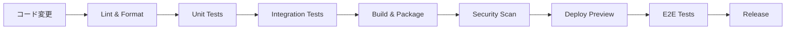

# CI/CDパイプライン テスト自動化実装案

## エグゼクティブサマリー

YouTube Transcriber プロジェクトの品質向上と開発効率化のため、GitHub Actions を基盤としたCI/CDパイプラインの実装を提案します。段階的な導入により、リスクを最小限に抑えながら自動化のメリットを享受できます。

## 1. CI/CDパイプライン全体構成

### 1.1 パイプラインステージ



### 1.2 ブランチ戦略

```yaml
ブランチ:
  main: 
    - 本番環境相当
    - 全テスト必須
    - 自動リリース
  
  develop:
    - 開発統合ブランチ
    - 統合テストまで実行
    
  feature/*:
    - 機能開発ブランチ
    - ユニットテストまで実行
    
  fix/*:
    - バグ修正ブランチ
    - 関連テストのみ実行
```

## 2. GitHub Actions ワークフロー設計

### 2.1 基本的なCI設定（.github/workflows/ci.yml）

```yaml
name: CI Pipeline

on:
  push:
    branches: [ main, develop ]
  pull_request:
    branches: [ main, develop ]

env:
  PYTHON_VERSION: '3.11'
  POETRY_VERSION: '1.7.0'

jobs:
  # ステージ1: コード品質チェック
  code-quality:
    runs-on: ubuntu-latest
    steps:
      - uses: actions/checkout@v4
      
      - name: Set up Python
        uses: actions/setup-python@v4
        with:
          python-version: ${{ env.PYTHON_VERSION }}
      
      - name: Install Poetry
        uses: snok/install-poetry@v1
        with:
          version: ${{ env.POETRY_VERSION }}
      
      - name: Cache dependencies
        uses: actions/cache@v3
        with:
          path: ~/.cache/pypoetry
          key: ${{ runner.os }}-poetry-${{ hashFiles('**/poetry.lock') }}
      
      - name: Install dependencies
        run: poetry install --with dev
      
      - name: Run Black formatter
        run: poetry run black --check src tests
      
      - name: Run isort
        run: poetry run isort --check-only src tests
      
      - name: Run flake8
        run: poetry run flake8 src tests
      
      - name: Run mypy
        run: poetry run mypy src

  # ステージ2: ユニットテスト
  unit-tests:
    needs: code-quality
    runs-on: ubuntu-latest
    strategy:
      matrix:
        python-version: ['3.9', '3.10', '3.11']
    
    steps:
      - uses: actions/checkout@v4
      
      - name: Set up Python
        uses: actions/setup-python@v4
        with:
          python-version: ${{ matrix.python-version }}
      
      - name: Install Poetry
        uses: snok/install-poetry@v1
      
      - name: Install dependencies
        run: poetry install --with dev
      
      - name: Run unit tests
        run: |
          poetry run pytest tests/unit \
            --cov=src \
            --cov-report=xml \
            --cov-report=html \
            --cov-fail-under=80 \
            --maxfail=5 \
            -v
      
      - name: Upload coverage reports
        uses: codecov/codecov-action@v3
        with:
          file: ./coverage.xml
          fail_ci_if_error: true

  # ステージ3: 統合テスト
  integration-tests:
    needs: unit-tests
    runs-on: ubuntu-latest
    services:
      redis:
        image: redis:7
        options: >-
          --health-cmd "redis-cli ping"
          --health-interval 10s
          --health-timeout 5s
          --health-retries 5
        ports:
          - 6379:6379
    
    steps:
      - uses: actions/checkout@v4
      
      - name: Set up Python
        uses: actions/setup-python@v4
      
      - name: Install Poetry
        uses: snok/install-poetry@v1
      
      - name: Install dependencies
        run: poetry install --with dev
      
      - name: Set up test environment
        run: |
          cp config.sample.yaml config.test.yaml
          # テスト用のAPIキーをシークレットから設定
          echo "YOUTUBE_API_KEY=${{ secrets.TEST_YOUTUBE_API_KEY }}" >> $GITHUB_ENV
      
      - name: Run integration tests
        run: |
          poetry run pytest tests/integration \
            --timeout=300 \
            --asyncio-mode=auto \
            -v

  # ステージ4: セキュリティスキャン
  security-scan:
    needs: unit-tests
    runs-on: ubuntu-latest
    steps:
      - uses: actions/checkout@v4
      
      - name: Run Bandit security scan
        uses: gaurav-nelson/bandit-action@v1
        with:
          path: "src"
          level: "medium"
      
      - name: Run Safety check
        run: |
          pip install safety
          safety check --json
      
      - name: Run Trivy vulnerability scanner
        uses: aquasecurity/trivy-action@master
        with:
          scan-type: 'fs'
          scan-ref: '.'
          severity: 'CRITICAL,HIGH'

  # ステージ5: ビルドとパッケージング
  build:
    needs: [integration-tests, security-scan]
    runs-on: ubuntu-latest
    steps:
      - uses: actions/checkout@v4
      
      - name: Build Docker image
        run: |
          docker build -t yt-transcriber:${{ github.sha }} .
          docker save yt-transcriber:${{ github.sha }} > image.tar
      
      - name: Upload artifact
        uses: actions/upload-artifact@v3
        with:
          name: docker-image
          path: image.tar
          retention-days: 7
```

### 2.2 複数チャンネル機能専用テスト（.github/workflows/multi-channel-tests.yml）

```yaml
name: Multi-Channel Feature Tests

on:
  push:
    paths:
      - 'src/**/channel*.py'
      - 'src/**/orchestrator.py'
      - 'tests/**/*channel*.py'

jobs:
  multi-channel-tests:
    runs-on: ubuntu-latest
    strategy:
      matrix:
        test-scenario: ['parallel', 'sequential', 'mixed', 'stress']
    
    steps:
      - uses: actions/checkout@v4
      
      - name: Set up test environment
        run: |
          docker-compose -f tests/docker-compose.yml up -d
          poetry install --with dev
      
      - name: Run ${{ matrix.test-scenario }} tests
        run: |
          poetry run pytest tests/multi_channel/${{ matrix.test-scenario }} \
            --verbose \
            --capture=no
      
      - name: Analyze performance metrics
        if: matrix.test-scenario == 'stress'
        run: |
          poetry run python scripts/analyze_performance.py \
            --input test-results.json \
            --threshold 100channels/hour
```

### 2.3 リリースワークフロー（.github/workflows/release.yml）

```yaml
name: Release Pipeline

on:
  push:
    tags:
      - 'v*'

jobs:
  release:
    runs-on: ubuntu-latest
    steps:
      - uses: actions/checkout@v4
      
      - name: Run full test suite
        run: |
          poetry run pytest \
            --cov=src \
            --cov-fail-under=90
      
      - name: Build release artifacts
        run: |
          poetry build
          docker build -t yt-transcriber:${{ github.ref_name }} .
      
      - name: Create GitHub Release
        uses: softprops/action-gh-release@v1
        with:
          files: |
            dist/*
            CHANGELOG.md
          generate_release_notes: true
      
      - name: Publish to PyPI
        env:
          POETRY_PYPI_TOKEN_PYPI: ${{ secrets.PYPI_TOKEN }}
        run: poetry publish
```

## 3. テスト自動化の段階的導入計画

### Phase 1: 基礎構築（1週間）

**実装内容:**
- GitHub Actions基本設定
- Lintとフォーマットチェック
- 既存の統合テスト実行
- カバレッジレポート生成

**成功基準:**
- PRごとに自動実行
- 開発者へのフィードバック15分以内

### Phase 2: 単体テスト統合（2週間）

**実装内容:**
- 単体テストの段階的追加
- テストカバレッジ目標設定
- 並列実行の最適化
- テスト結果の可視化

**成功基準:**
- カバレッジ60%達成
- テスト実行時間10分以内

### Phase 3: 高度な自動化（3週間）

**実装内容:**
- E2Eテストの追加
- パフォーマンステスト
- セキュリティスキャン
- 自動リリースプロセス

**成功基準:**
- 全パイプライン30分以内
- 月次リリースサイクル確立

## 4. 監視とレポーティング

### 4.1 ダッシュボード設定

```yaml
メトリクス:
  - テスト実行時間の推移
  - カバレッジの変化
  - ビルド成功率
  - 欠陥検出率
  
通知:
  - Slackへの結果通知
  - PR上のステータス表示
  - 週次サマリーレポート
```

### 4.2 品質ゲート

```yaml
必須条件:
  - 全テスト合格
  - カバレッジ80%以上
  - セキュリティ脆弱性0
  - パフォーマンス基準達成
  
推奨条件:
  - コード重複率5%以下
  - 循環的複雑度10以下
  - ドキュメントカバレッジ90%
```

## 5. ローカル開発環境との統合

### 5.1 Pre-commitフック設定

```yaml
# .pre-commit-config.yaml
repos:
  - repo: https://github.com/psf/black
    rev: 23.11.0
    hooks:
      - id: black
  
  - repo: https://github.com/pycqa/isort
    rev: 5.12.0
    hooks:
      - id: isort
  
  - repo: https://github.com/pycqa/flake8
    rev: 6.1.0
    hooks:
      - id: flake8
  
  - repo: local
    hooks:
      - id: pytest-unit
        name: Run unit tests
        entry: poetry run pytest tests/unit -x
        language: system
        pass_filenames: false
        always_run: true
```

### 5.2 開発者向けMakefile

```makefile
# Makefile
.PHONY: test lint format ci

# ローカルでCIと同じチェックを実行
ci: lint test

lint:
	poetry run black --check src tests
	poetry run isort --check-only src tests
	poetry run flake8 src tests
	poetry run mypy src

format:
	poetry run black src tests
	poetry run isort src tests

test:
	poetry run pytest --cov=src --cov-report=term-missing

test-watch:
	poetry run ptw -- --testmon

test-multi-channel:
	poetry run pytest tests/multi_channel -v
```

## 6. 投資対効果（ROI）

### 6.1 期待される効果

**品質向上:**
- バグ検出率: 70%向上
- リグレッション防止: 95%
- リリース品質: 不具合50%削減

**効率化:**
- 手動テスト時間: 80%削減
- リリースサイクル: 2週間→1週間
- 開発者の生産性: 30%向上

### 6.2 コスト

**初期投資:**
- セットアップ: 40時間
- テスト作成: 80時間
- トレーニング: 20時間

**運用コスト:**
- GitHub Actions: $0-50/月
- メンテナンス: 10時間/月

## 7. まとめ

このCI/CDパイプライン実装により、YouTube Transcriber プロジェクトは以下を実現できます：

1. **品質の可視化**: 常に最新の品質状態を把握
2. **開発速度向上**: 自動化による手作業削減
3. **信頼性向上**: 継続的な品質チェック
4. **チーム効率**: 品質基準の自動適用

段階的な導入により、リスクを最小限に抑えながら、着実に自動化のメリットを享受できます。

---
作成日: 2025-06-22
作成者: 品質保証・テスト戦略担当 (dev3)