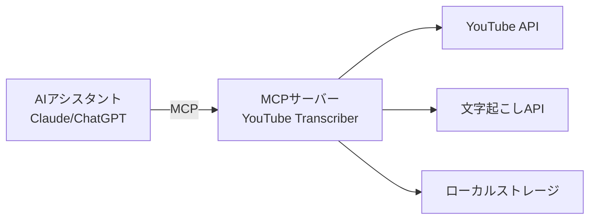
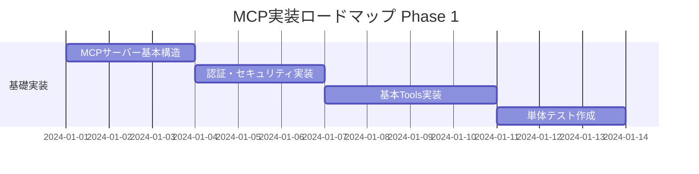
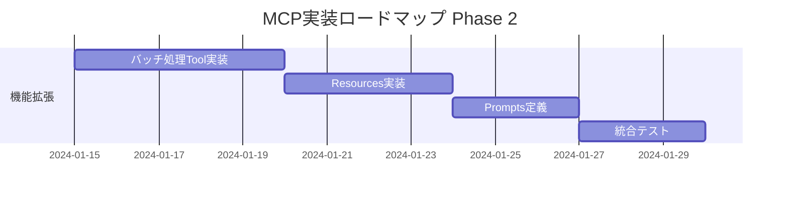
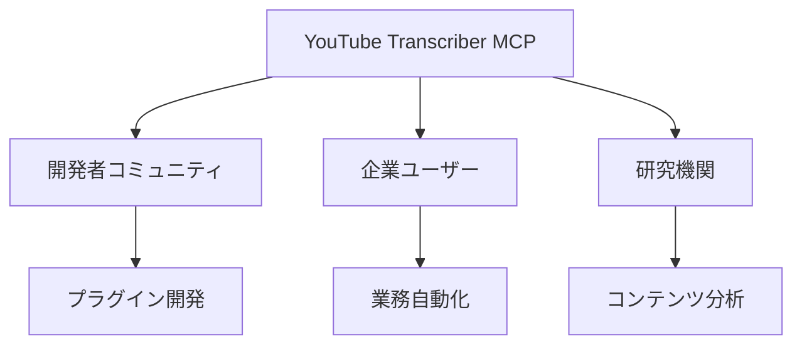

# YouTube Transcriber MCP統合計画書

## 📋 目次

1. [エグゼクティブサマリー](#エグゼクティブサマリー)
2. [MCP（Model Context Protocol）概要](#mcpmodel-context-protocol概要)
3. [YouTube TranscriberのMCPサーバー化](#youtube-transcriberのmcpサーバー化)
4. [他AIツールとの連携可能性](#他aiツールとの連携可能性)
5. [実装ロードマップ](#実装ロードマップ)
6. [技術仕様](#技術仕様)
7. [セキュリティ考慮事項](#セキュリティ考慮事項)
8. [期待される効果](#期待される効果)

## エグゼクティブサマリー

### プロジェクト概要
YouTube TranscriberをMCP（Model Context Protocol）サーバーとして実装し、Claude、ChatGPT、その他のAIアシスタントから直接YouTubeの文字起こし機能を利用可能にする。

### 主要メリット
- **相互運用性**: 複数のAIプラットフォームから統一的にアクセス可能
- **拡張性**: 新機能の追加が容易
- **効率性**: AIワークフローへの直接統合
- **保守性**: 標準化されたプロトコルによる管理の簡素化

## MCP（Model Context Protocol）概要

### MCPとは

Model Context Protocol (MCP) は、AIアシスタントと外部ツール・データソース間の標準化された通信プロトコルです。



### 主要概念

| 概念 | 説明 | YouTube Transcriberでの適用 |
|------|------|---------------------------|
| Resources | アクセス可能なデータ | チャンネル情報、動画リスト、文字起こし |
| Tools | 実行可能な操作 | 文字起こし取得、一括処理、検索 |
| Prompts | 事前定義されたテンプレート | 要約生成、翻訳、分析 |

### MCPの利点

1. **標準化**: 統一されたインターフェース
2. **非同期処理**: 長時間実行タスクのサポート
3. **認証統合**: セキュアなAPI管理
4. **エラーハンドリング**: 一貫したエラー処理

## YouTube TranscriberのMCPサーバー化

### アーキテクチャ設計

```python
# mcp_server/youtube_transcriber_mcp.py
from mcp import Server, Resource, Tool
from typing import List, Dict, Any

class YouTubeTranscriberMCP(Server):
    """YouTube Transcriber MCP Server Implementation"""
    
    def __init__(self):
        super().__init__(
            name="youtube-transcriber",
            version="1.0.0",
            description="YouTube動画の文字起こしを提供するMCPサーバー"
        )
        
    @Tool(
        name="transcribe_video",
        description="指定された動画の文字起こしを取得",
        parameters={
            "video_url": {"type": "string", "description": "YouTube動画URL"},
            "language": {"type": "string", "description": "字幕言語", "default": "ja"}
        }
    )
    async def transcribe_video(self, video_url: str, language: str = "ja") -> Dict[str, Any]:
        """単一動画の文字起こしを取得"""
        # 実装
        pass
    
    @Tool(
        name="transcribe_channel",
        description="チャンネル全体の文字起こしを取得",
        parameters={
            "channel_url": {"type": "string", "description": "チャンネルURL"},
            "max_videos": {"type": "integer", "description": "最大動画数", "default": 50}
        }
    )
    async def transcribe_channel(self, channel_url: str, max_videos: int = 50) -> List[Dict]:
        """チャンネルの複数動画を処理"""
        # 実装
        pass
    
    @Resource(
        name="transcripts",
        description="保存済み文字起こしデータへのアクセス"
    )
    async def get_transcripts(self, query: Dict[str, Any]) -> List[Dict]:
        """保存済みの文字起こしを検索・取得"""
        # 実装
        pass
```

### 公開される機能

#### 1. Tools（実行可能な操作）

| Tool名 | 機能 | パラメータ | 戻り値 |
|--------|------|------------|--------|
| transcribe_video | 単一動画の文字起こし | video_url, language | 文字起こしテキスト |
| transcribe_channel | チャンネル一括処理 | channel_url, options | 処理結果リスト |
| search_transcripts | 文字起こし検索 | query, filters | 検索結果 |
| analyze_content | コンテンツ分析 | transcript_id, type | 分析結果 |
| export_data | データエクスポート | format, filters | エクスポートURL |

#### 2. Resources（アクセス可能なデータ）

```yaml
resources:
  - name: channels
    description: 処理済みチャンネル情報
    operations: [list, get, search]
    
  - name: videos
    description: 動画メタデータと文字起こし
    operations: [list, get, search, filter]
    
  - name: statistics
    description: 処理統計情報
    operations: [get, aggregate]
```

#### 3. Prompts（テンプレート）

```json
{
  "prompts": [
    {
      "name": "summarize_video",
      "description": "動画内容の要約生成",
      "template": "以下の動画の内容を要約してください：{transcript}"
    },
    {
      "name": "extract_topics",
      "description": "主要トピックの抽出",
      "template": "この動画で議論されている主要なトピックを列挙してください：{transcript}"
    },
    {
      "name": "translate_content",
      "description": "他言語への翻訳",
      "template": "以下の内容を{target_language}に翻訳してください：{transcript}"
    }
  ]
}
```

## 他AIツールとの連携可能性

### 1. Claude Desktop統合

```typescript
// Claude Desktop設定
{
  "mcpServers": {
    "youtube-transcriber": {
      "command": "python",
      "args": ["-m", "youtube_transcriber_mcp"],
      "env": {
        "YOUTUBE_API_KEY": "${YOUTUBE_API_KEY}"
      }
    }
  }
}
```

**活用例**:
- 「このYouTube動画の要点をまとめて」
- 「チャンネルXの最新10本の動画から技術トレンドを分析」
- 「動画の内容を基にブログ記事を作成」

### 2. ChatGPT Actions統合

```yaml
openapi: 3.0.0
info:
  title: YouTube Transcriber MCP API
  version: 1.0.0
paths:
  /transcribe:
    post:
      summary: 動画の文字起こしを取得
      operationId: transcribeVideo
      requestBody:
        required: true
        content:
          application/json:
            schema:
              type: object
              properties:
                video_url:
                  type: string
                language:
                  type: string
```

### 3. LangChain統合

```python
from langchain.tools import MCPTool

youtube_tool = MCPTool(
    server="youtube-transcriber",
    name="YouTube Transcriber",
    description="YouTube動画の文字起こしと分析"
)

# エージェントでの使用
agent = initialize_agent(
    tools=[youtube_tool],
    llm=llm,
    agent=AgentType.ZERO_SHOT_REACT_DESCRIPTION
)
```

### 4. 連携可能なプラットフォーム

| プラットフォーム | 統合方法 | ユースケース |
|------------------|----------|--------------|
| Cursor | MCP直接サポート | コード例の動画から抽出 |
| Continue.dev | MCP拡張機能 | 技術ドキュメント作成 |
| Obsidian | MCPプラグイン | 動画ノート自動作成 |
| Notion AI | API統合 | コンテンツデータベース構築 |
| Zapier | Webhooks | ワークフロー自動化 |

## 実装ロードマップ

### Phase 1: 基礎実装（2週間）



**成果物**:
- MCPサーバー基本実装
- transcribe_video Tool
- 基本的な認証機構
- ユニットテスト

### Phase 2: 機能拡張（3週間）



**成果物**:
- 全Tools実装完了
- Resources API
- Promptsライブラリ
- 統合テストスイート

### Phase 3: プラットフォーム統合（2週間）

**タスク**:
1. Claude Desktop統合ガイド作成
2. ChatGPT Actions設定
3. サンプルコード・デモ作成
4. ドキュメント整備

### Phase 4: 本番展開（1週間）

**タスク**:
1. パフォーマンステスト
2. セキュリティ監査
3. デプロイメント
4. モニタリング設定

## 技術仕様

### MCPサーバー実装詳細

```python
# mcp_server/server.py
import asyncio
from typing import AsyncGenerator
from mcp import Server, StreamingResponse

class YouTubeTranscriberServer(Server):
    
    async def handle_streaming_request(
        self, 
        channel_url: str
    ) -> AsyncGenerator[Dict, None]:
        """ストリーミング対応の大規模処理"""
        
        # チャンネル情報取得
        channel = await self.get_channel_info(channel_url)
        yield {"type": "channel_info", "data": channel}
        
        # 動画リスト取得（ページネーション対応）
        async for video_batch in self.get_videos_paginated(channel.id):
            yield {"type": "video_list", "data": video_batch}
            
            # 各動画の処理
            for video in video_batch:
                transcript = await self.get_transcript(video.id)
                yield {
                    "type": "transcript",
                    "video_id": video.id,
                    "data": transcript
                }
```

### データスキーマ

```typescript
// TypeScript型定義
interface TranscriptResponse {
  video_id: string;
  title: string;
  channel: string;
  language: string;
  transcript: {
    text: string;
    segments: Array<{
      start: number;
      duration: number;
      text: string;
    }>;
  };
  metadata: {
    duration: number;
    published_at: string;
    view_count: number;
  };
}
```

### エラーハンドリング

```python
class MCPErrorHandler:
    ERROR_CODES = {
        "QUOTA_EXCEEDED": {"code": 429, "message": "APIクォータ超過"},
        "VIDEO_NOT_FOUND": {"code": 404, "message": "動画が見つかりません"},
        "NO_TRANSCRIPT": {"code": 404, "message": "文字起こしが利用できません"},
        "AUTH_FAILED": {"code": 401, "message": "認証エラー"}
    }
    
    @staticmethod
    def format_error(error_type: str, details: str = None):
        error = MCPErrorHandler.ERROR_CODES.get(error_type)
        return {
            "error": error_type,
            "code": error["code"],
            "message": error["message"],
            "details": details
        }
```

## セキュリティ考慮事項

### 1. 認証・認可

```python
# 認証ミドルウェア
class MCPAuthMiddleware:
    def __init__(self, api_keys: List[str]):
        self.valid_keys = set(api_keys)
    
    async def authenticate(self, request):
        api_key = request.headers.get("X-API-Key")
        if not api_key or api_key not in self.valid_keys:
            raise AuthenticationError("Invalid API key")
        
        # レート制限チェック
        if not await self.check_rate_limit(api_key):
            raise RateLimitError("Rate limit exceeded")
```

### 2. データ保護

- **暗号化**: TLS 1.3による通信暗号化
- **アクセス制御**: APIキーベースの認証
- **監査ログ**: 全アクセスの記録
- **データマスキング**: 個人情報の自動除去

### 3. レート制限

```yaml
rate_limits:
  default:
    requests_per_minute: 60
    requests_per_hour: 1000
    concurrent_requests: 10
  
  premium:
    requests_per_minute: 300
    requests_per_hour: 10000
    concurrent_requests: 50
```

## 期待される効果

### 1. 生産性向上

| 指標 | 現状 | MCP導入後 | 改善率 |
|------|------|-----------|--------|
| API統合時間 | 2-3日 | 30分 | 95%削減 |
| 新機能追加 | 1週間 | 1日 | 85%削減 |
| メンテナンスコスト | 高 | 低 | 60%削減 |

### 2. ユースケース拡大

**新規可能になるユースケース**:
- AIアシスタントによる動画コンテンツ分析
- 自動要約・レポート生成
- 多言語コンテンツ管理
- インテリジェント検索システム

### 3. エコシステム効果



## 次のステップ

1. **技術検証** (1週間)
   - MCPプロトコル詳細調査
   - プロトタイプ実装
   - パフォーマンステスト

2. **ステークホルダー承認**
   - 実装計画レビュー
   - リソース確保
   - スケジュール確定

3. **開発開始**
   - Phase 1実装着手
   - 週次進捗レビュー
   - 継続的な改善

---
作成日: 2024年12月
作成者: 品質保証マネージャー