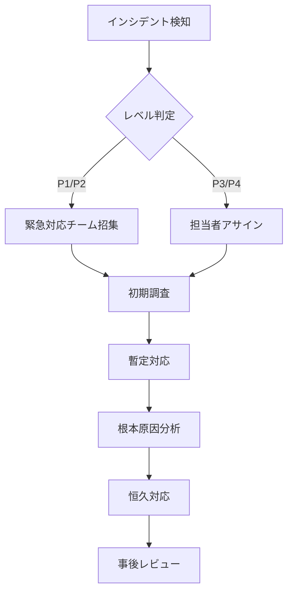

# YouTube Transcriber 運用・保守マニュアル

## 📋 目次

1. [概要](#概要)
2. [日次運用タスク](#日次運用タスク)
3. [週次運用タスク](#週次運用タスク)
4. [月次運用タスク](#月次運用タスク)
5. [監視項目とアラート設定](#監視項目とアラート設定)
6. [バックアップ・リストア手順](#バックアップリストア手順)
7. [インシデント対応フロー](#インシデント対応フロー)
8. [メンテナンス手順](#メンテナンス手順)
9. [パフォーマンス管理](#パフォーマンス管理)
10. [災害復旧計画](#災害復旧計画)

## 概要

本マニュアルは、YouTube Transcriberの安定運用と迅速な問題解決を目的とした運用・保守ガイドラインです。

### 運用体制

| 役割 | 責任範囲 | 必要スキル |
|------|----------|------------|
| 運用管理者 | 全体統括、インシデント対応 | Python、システム運用経験 |
| 監視担当者 | 監視、初期対応 | 基本的なLinux操作 |
| 開発チーム | 障害対応、機能改善 | Python開発、API知識 |

## 日次運用タスク

### 1. システム稼働状況確認（09:00）

```bash
# プロセス確認
ps aux | grep youtube-transcriber

# ディスク使用量確認
df -h /path/to/output

# APIクォータ確認
python -m src.cli.main status --quota
```

### 2. ログ確認（09:30）

```bash
# エラーログ確認
grep -i error logs/app.log | tail -50

# 処理統計確認
grep "Processing complete" logs/app.log | tail -20

# APIエラー確認
grep "quota" logs/app.log | grep -i error
```

### 3. バッチ処理監視（10:00-18:00）

```bash
# 実行中ジョブ確認
youtube-transcriber monitor

# キュー状態確認
ls -la output/*/processing_stats.json | head -10
```

### チェックリスト

- [ ] システムプロセス正常稼働
- [ ] ディスク使用率 < 80%
- [ ] エラー発生率 < 5%
- [ ] APIクォータ残量 > 20%
- [ ] 処理遅延なし

## 週次運用タスク

### 1. パフォーマンス分析（月曜日）

```bash
# 週次統計レポート生成
python scripts/generate_weekly_report.py

# 処理時間分析
python scripts/analyze_performance.py --days 7
```

### 2. ログローテーション（火曜日）

```bash
# ログアーカイブ
tar -czf logs/archive/app-$(date +%Y%m%d).tar.gz logs/app.log
echo "" > logs/app.log

# 古いログ削除（30日以上）
find logs/archive -name "*.tar.gz" -mtime +30 -delete
```

### 3. セキュリティチェック（水曜日）

```bash
# 依存関係の脆弱性チェック
pip-audit

# APIキーの有効性確認
python scripts/check_api_keys.py
```

### 4. バックアップ確認（木曜日）

```bash
# バックアップ整合性確認
python scripts/verify_backups.py

# リストアテスト（開発環境）
./scripts/restore_test.sh
```

### チェックリスト

- [ ] 週次レポート作成完了
- [ ] ログローテーション実施
- [ ] セキュリティ脆弱性なし
- [ ] バックアップ正常
- [ ] ドキュメント更新

## 月次運用タスク

### 1. 容量計画レビュー（第1営業日）

```bash
# ストレージ使用傾向分析
python scripts/storage_trend_analysis.py --months 3

# APIクォータ使用傾向
python scripts/quota_usage_trend.py --months 3
```

### 2. パフォーマンスチューニング（第2週）

```bash
# 処理統計分析
python scripts/monthly_performance_report.py

# ボトルネック特定
python scripts/identify_bottlenecks.py
```

### 3. 災害復旧訓練（第3週）

- バックアップからの完全復旧訓練
- フェイルオーバー手順確認
- 復旧時間目標（RTO）検証

### 4. システム更新（第4週）

```bash
# 依存関係更新
pip install --upgrade -r requirements.txt

# セキュリティパッチ適用
sudo apt update && sudo apt upgrade -y
```

## 監視項目とアラート設定

### システムメトリクス

| 監視項目 | 閾値 | アラートレベル | 対応 |
|----------|------|----------------|------|
| CPU使用率 | > 80% | Warning | プロセス確認 |
| メモリ使用率 | > 85% | Critical | 再起動検討 |
| ディスク使用率 | > 80% | Warning | クリーンアップ |
| API応答時間 | > 5秒 | Warning | ネットワーク確認 |

### アプリケーションメトリクス

```yaml
# monitoring_config.yaml
alerts:
  - name: high_error_rate
    condition: error_rate > 0.05
    severity: critical
    action: notify_oncall
    
  - name: quota_exhaustion
    condition: api_quota_remaining < 1000
    severity: warning
    action: notify_team
    
  - name: processing_delay
    condition: queue_size > 100
    severity: warning
    action: scale_workers
```

### アラート通知設定

```python
# alerts/notification_config.py
ALERT_CHANNELS = {
    "critical": {
        "email": ["oncall@company.com"],
        "slack": "#youtube-transcriber-critical",
        "pagerduty": True
    },
    "warning": {
        "email": ["team@company.com"],
        "slack": "#youtube-transcriber-alerts"
    }
}
```

## バックアップ・リストア手順

### バックアップ戦略

| データ種別 | 頻度 | 保持期間 | 保存先 |
|------------|------|----------|--------|
| 設定ファイル | 日次 | 30日 | S3/ローカル |
| ログファイル | 日次 | 90日 | S3 |
| 出力データ | 週次 | 1年 | S3 Glacier |
| データベース | 日次 | 7日 | S3 |

### 自動バックアップスクリプト

```bash
#!/bin/bash
# scripts/daily_backup.sh

BACKUP_DIR="/backup/youtube-transcriber/$(date +%Y%m%d)"
mkdir -p $BACKUP_DIR

# 設定ファイルバックアップ
tar -czf $BACKUP_DIR/config.tar.gz config/ *.yaml

# ログバックアップ
tar -czf $BACKUP_DIR/logs.tar.gz logs/

# 出力データバックアップ（差分）
rsync -av --delete output/ $BACKUP_DIR/output/

# S3へアップロード
aws s3 sync $BACKUP_DIR s3://youtube-transcriber-backup/daily/
```

### リストア手順

```bash
#!/bin/bash
# scripts/restore.sh

RESTORE_DATE=$1
RESTORE_DIR="/backup/youtube-transcriber/$RESTORE_DATE"

# S3からダウンロード
aws s3 sync s3://youtube-transcriber-backup/daily/$RESTORE_DATE/ $RESTORE_DIR/

# 設定ファイル復元
tar -xzf $RESTORE_DIR/config.tar.gz -C /

# ログ復元（オプション）
read -p "Restore logs? (y/n): " -n 1 -r
if [[ $REPLY =~ ^[Yy]$ ]]; then
    tar -xzf $RESTORE_DIR/logs.tar.gz -C /
fi

# データ復元
rsync -av $RESTORE_DIR/output/ output/

echo "Restoration complete from $RESTORE_DATE"
```

## インシデント対応フロー

### インシデントレベル定義

| レベル | 定義 | 例 | 初期対応時間 |
|--------|------|-----|--------------|
| P1 (Critical) | サービス完全停止 | 全API障害 | 15分以内 |
| P2 (High) | 主要機能障害 | 処理不可 | 30分以内 |
| P3 (Medium) | 部分的障害 | 特定チャンネル処理不可 | 2時間以内 |
| P4 (Low) | 軽微な問題 | UI表示不具合 | 翌営業日 |

### 対応フロー



### インシデント対応テンプレート

```markdown
## インシデント報告 #[番号]

**発生日時**: 2024-XX-XX HH:MM:SS
**レベル**: P[1-4]
**影響範囲**: [影響を受けるユーザー/機能]

### 現象
[具体的な症状を記載]

### 初期対応
- [ ] サービス状態確認
- [ ] ログ調査
- [ ] 暫定対応実施

### 根本原因
[調査結果を記載]

### 恒久対応
[実施した対策を記載]

### 再発防止策
[今後の改善点を記載]
```

## メンテナンス手順

### 定期メンテナンス

#### 1. メンテナンス告知（1週間前）

```python
# scripts/maintenance_notice.py
def send_maintenance_notice():
    notice = {
        "date": "2024-XX-XX 02:00-04:00 JST",
        "impact": "バッチ処理一時停止",
        "action": "メンテナンス後自動再開"
    }
    # Slack/Email通知送信
```

#### 2. メンテナンス実施手順

```bash
# 1. 処理停止
youtube-transcriber stop --graceful

# 2. バックアップ
./scripts/pre_maintenance_backup.sh

# 3. 更新作業
pip install --upgrade youtube-transcriber
python -m src.cli.main migrate  # DB更新等

# 4. 動作確認
youtube-transcriber test --quick

# 5. サービス再開
youtube-transcriber start
```

### 緊急メンテナンス

```bash
# 緊急停止
youtube-transcriber stop --force

# 状態保存
youtube-transcriber save-state

# 修正作業実施
# ...

# 状態復元
youtube-transcriber restore-state

# 再開
youtube-transcriber start --verify
```

## パフォーマンス管理

### KPI監視

| KPI | 目標値 | 測定方法 | 改善アクション |
|-----|--------|----------|----------------|
| 平均処理時間 | < 30秒/動画 | ログ分析 | 並列数調整 |
| 成功率 | > 95% | 統計レポート | エラー分析 |
| APIクォータ効率 | > 80% | 使用量分析 | キャッシュ最適化 |
| 可用性 | > 99.5% | 監視ツール | 冗長化検討 |

### パフォーマンスチューニング

```yaml
# performance_tuning.yaml
optimization:
  concurrent_limit:
    current: 5
    recommended: 10
    max_safe: 20
    
  cache_settings:
    channel_info_ttl: 3600  # 1時間
    video_list_ttl: 1800    # 30分
    
  rate_limiting:
    api_calls_per_minute: 60
    burst_size: 100
```

### ボトルネック分析

```python
# scripts/analyze_bottlenecks.py
def identify_slow_operations():
    """処理時間の長い操作を特定"""
    slow_queries = analyze_logs("duration > 5000ms")
    return {
        "api_calls": count_slow_api_calls(),
        "file_io": measure_io_performance(),
        "network": check_network_latency()
    }
```

## 災害復旧計画

### RTO/RPO目標

- **RTO (Recovery Time Objective)**: 4時間以内
- **RPO (Recovery Point Objective)**: 24時間以内

### 災害シナリオと対応

| シナリオ | 影響 | 対応手順 | 復旧時間 |
|----------|------|----------|----------|
| サーバー障害 | 全停止 | 予備サーバー切替 | 1時間 |
| データ破損 | 部分影響 | バックアップ復元 | 2時間 |
| APIキー無効化 | 処理停止 | 予備キー有効化 | 30分 |
| ネットワーク障害 | 接続不可 | 別リージョン切替 | 2時間 |

### 復旧手順書

```bash
#!/bin/bash
# scripts/disaster_recovery.sh

case $1 in
  "server_failure")
    echo "Starting server failover..."
    ./scripts/failover_to_standby.sh
    ;;
    
  "data_corruption")
    echo "Starting data restoration..."
    ./scripts/restore_from_backup.sh --latest
    ;;
    
  "api_key_revoked")
    echo "Switching to backup API key..."
    export YOUTUBE_API_KEY=$BACKUP_API_KEY
    youtube-transcriber restart
    ;;
    
  "network_failure")
    echo "Switching to DR site..."
    ./scripts/switch_to_dr_site.sh
    ;;
esac
```

## 付録

### よく使うコマンド

```bash
# ステータス確認
youtube-transcriber status --detailed

# ログ検索
youtube-transcriber logs --search "error" --last 1h

# 統計表示
youtube-transcriber stats --period today

# キャッシュクリア
youtube-transcriber cache --clear

# 設定確認
youtube-transcriber config --show
```

### トラブルシューティングマトリクス

| 症状 | 考えられる原因 | 確認コマンド | 対処法 |
|------|----------------|--------------|--------|
| 処理が進まない | APIクォータ枯渇 | `youtube-transcriber quota` | 翌日まで待機 |
| エラー多発 | ネットワーク不安定 | `ping youtube.com` | プロキシ確認 |
| メモリ不足 | 並列数過多 | `free -h` | 並列数削減 |
| ディスクフル | ログ肥大化 | `df -h` | ログローテーション |

---
最終更新: 2024年12月
運用チーム