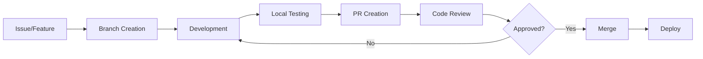

# YouTube Transcriber Project Handbook

## Table of Contents

1. [Project Overview](#project-overview)
2. [Project History](#project-history)
3. [Team Structure](#team-structure)
4. [Development Workflow](#development-workflow)
5. [Important Resources](#important-resources)
6. [Communication Channels](#communication-channels)
7. [Deployment Process](#deployment-process)
8. [Troubleshooting Guide](#troubleshooting-guide)
9. [FAQ for Developers](#faq-for-developers)
10. [Project Values and Culture](#project-values-and-culture)

## Project Overview

### Mission Statement

YouTube Transcriber empowers users to efficiently extract, process, and analyze transcripts from YouTube videos at scale, making video content searchable and accessible.

### Core Objectives

1. **Accessibility**: Make YouTube content searchable and analyzable
2. **Efficiency**: Process channels and videos at scale
3. **Reliability**: Robust error handling and recovery
4. **Usability**: Intuitive interface for technical and non-technical users
5. **Extensibility**: Plugin architecture for custom workflows

### Target Users

- **Researchers**: Academic and market research
- **Content Creators**: Channel backup and analysis
- **Journalists**: Fact-checking and source material
- **Businesses**: Competitive analysis and content strategy
- **Developers**: API integration and automation

### Key Features

- ✅ Single and batch channel processing
- ✅ Multiple output formats (TXT, JSON, CSV, Markdown)
- ✅ Parallel processing with smart concurrency
- ✅ Beautiful terminal UI with real-time progress
- ✅ Comprehensive error handling and recovery
- ✅ API quota management
- ✅ Cross-platform support

## Project History

### Timeline

#### Phase 1: Initial Development (Months 1-2)
- **Objective**: Create basic YouTube transcript downloader
- **Key Achievements**:
  - Basic CLI implementation
  - Single channel processing
  - Text output format
  - Core architecture established

#### Phase 2: Enhancement (Months 3-4)
- **Objective**: Add advanced features and improve UX
- **Key Achievements**:
  - Rich terminal UI with progress bars
  - Multiple output formats
  - Error handling improvements
  - Parallel video processing

#### Phase 3: Multi-Channel Support (Months 5-6)
- **Objective**: Enable batch processing at scale
- **Key Achievements**:
  - Multi-channel batch processing
  - Interactive channel selection
  - Advanced concurrency control
  - UI-backend bridge architecture
  - Comprehensive documentation

### Major Milestones

1. **v0.1.0** - First working prototype
2. **v0.5.0** - Public alpha release
3. **v1.0.0** - Production-ready release
4. **v1.5.0** - Multi-channel support
5. **Future** - Web UI and platform features

### Key Technical Decisions

1. **Python + Asyncio**: For efficient concurrent processing
2. **Typer + Rich**: For beautiful CLI experience
3. **Layered Architecture**: For maintainability
4. **Repository Pattern**: For testability
5. **Event-Driven Updates**: For responsive UI

## Team Structure

### Core Team Roles

#### Project Lead / Architect
- **Responsibilities**:
  - Technical direction
  - Architecture decisions
  - Code review final approval
  - Release management

#### Backend Developers
- **Responsibilities**:
  - Core processing logic
  - API integrations
  - Performance optimization
  - Service layer implementation

#### Frontend/UI Developers
- **Responsibilities**:
  - CLI interface design
  - Terminal UI components
  - User experience optimization
  - Interactive features

#### QA Engineers
- **Responsibilities**:
  - Test strategy
  - Integration testing
  - Performance testing
  - Bug verification

#### Documentation Team
- **Responsibilities**:
  - User documentation
  - API documentation
  - Developer guides
  - Tutorial creation

### Contribution Model

```
Feature Request → Issue Creation → Design Discussion → Implementation → Review → Merge
                                           ↓
                                    Community Input
```

### Decision Making

1. **Technical Decisions**: Tech lead with team input
2. **Feature Priorities**: Community voting + core team
3. **Release Schedule**: Project lead with team consensus
4. **Breaking Changes**: Requires team majority approval

## Development Workflow

### 1. Local Development Setup

```bash
# Clone repository
git clone https://github.com/yourusername/youtube-transcriber.git
cd youtube-transcriber

# Create virtual environment
python -m venv venv
source venv/bin/activate  # Windows: venv\Scripts\activate

# Install development dependencies
pip install -e ".[dev]"

# Set up pre-commit hooks
pre-commit install

# Configure environment
cp .env.example .env
# Edit .env with your API key

# Run tests
pytest

# Start developing!
```

### 2. Development Cycle



### 3. Branch Strategy

- **main**: Stable, production-ready code
- **develop**: Integration branch for features
- **feature/***: Individual feature branches
- **bugfix/***: Bug fix branches
- **release/***: Release preparation branches
- **hotfix/***: Emergency production fixes

### 4. Commit Guidelines

```bash
# Format: <type>(<scope>): <subject>

feat(cli): Add interactive channel selection
fix(api): Handle rate limit errors gracefully
docs(readme): Update installation instructions
test(channel): Add edge case coverage
refactor(service): Simplify error handling
style(ui): Improve progress bar colors
chore(deps): Update Rich to v13.0.0
```

### 5. Code Review Checklist

- [ ] Tests pass and coverage maintained
- [ ] Documentation updated
- [ ] Type hints added
- [ ] Error handling appropriate
- [ ] Performance impact considered
- [ ] Security implications reviewed
- [ ] Backwards compatibility maintained
- [ ] UI/UX consistency checked

## Important Resources

### Documentation

| Resource | URL | Description |
|----------|-----|-------------|
| User Guide | `/docs/USER_GUIDE.md` | End-user documentation |
| API Reference | `/docs/API_SPECIFICATION.md` | Complete API documentation |
| Architecture | `/docs/ARCHITECTURE.md` | System design and architecture |
| Developer Guide | `/docs/DEVELOPER_GUIDE.md` | Development setup and practices |

### External Resources

| Resource | URL | Purpose |
|----------|-----|---------|
| YouTube API Docs | https://developers.google.com/youtube/v3 | Official API reference |
| Python Asyncio | https://docs.python.org/3/library/asyncio.html | Async programming guide |
| Rich Documentation | https://rich.readthedocs.io | Terminal UI library |
| Typer Documentation | https://typer.tiangolo.com | CLI framework |

### Tools and Services

| Tool | Purpose | Access |
|------|---------|--------|
| GitHub | Code repository | Public |
| GitHub Actions | CI/CD pipeline | Automatic |
| PyPI | Package distribution | Maintainer access |
| Discord | Community chat | Public invite |
| Sentry | Error tracking | Team access |

## Communication Channels

### Internal Communication

1. **GitHub Issues**: Feature requests, bug reports
2. **GitHub Discussions**: Design discussions, Q&A
3. **Pull Request Comments**: Code review discussions
4. **Discord #dev**: Real-time development chat
5. **Weekly Standup**: Video call (optional)

### External Communication

1. **Discord #general**: Community support
2. **Twitter @yt_transcriber**: Announcements
3. **GitHub Releases**: Release notes
4. **Blog Posts**: Major features and tutorials
5. **Email List**: Security announcements

### Response Time Expectations

- **Critical Security Issues**: < 24 hours
- **Bug Reports**: < 72 hours
- **Feature Requests**: < 1 week
- **Pull Requests**: < 1 week
- **General Questions**: Best effort

## Deployment Process

### 1. Version Management

```bash
# Semantic versioning: MAJOR.MINOR.PATCH
# Example: 1.5.2

MAJOR: Breaking changes
MINOR: New features (backwards compatible)
PATCH: Bug fixes
```

### 2. Release Checklist

```markdown
- [ ] All tests passing
- [ ] Documentation updated
- [ ] CHANGELOG.md updated
- [ ] Version bumped in pyproject.toml
- [ ] Migration guide (if breaking changes)
- [ ] Security audit completed
- [ ] Performance benchmarks run
- [ ] Release notes drafted
```

### 3. Release Process

```bash
# 1. Create release branch
git checkout -b release/v1.5.0

# 2. Update version
poetry version minor

# 3. Update changelog
# Edit CHANGELOG.md

# 4. Commit changes
git commit -m "chore: Prepare release v1.5.0"

# 5. Create PR to main
# Get approval and merge

# 6. Tag release
git tag -a v1.5.0 -m "Release version 1.5.0"
git push origin v1.5.0

# 7. Build and publish
poetry build
poetry publish

# 8. Create GitHub release
# Use tag and include changelog
```

### 4. Hotfix Process

```bash
# For critical production issues only
git checkout -b hotfix/v1.5.1 main
# Make minimal fix
# Follow abbreviated release process
# Cherry-pick to develop
```

## Troubleshooting Guide

### Common Development Issues

#### 1. Import Errors
```python
# Problem: ModuleNotFoundError
# Solution:
pip install -e .  # Reinstall in editable mode
```

#### 2. Async Deadlocks
```python
# Problem: Program hangs
# Solution: Check for missing 'await' keywords
# Debug with:
import asyncio
asyncio.get_event_loop().set_debug(True)
```

#### 3. Type Check Failures
```bash
# Problem: mypy errors
# Solution:
mypy --install-types  # Install missing type stubs
# Add type: ignore comment for third-party issues
```

#### 4. Test Failures
```bash
# Problem: Tests fail locally but pass in CI
# Solution:
# Check Python version
python --version
# Clear test cache
pytest --cache-clear
# Run specific test
pytest -xvs path/to/test.py::test_name
```

### Performance Issues

#### 1. Memory Leaks
```python
# Debug with memory_profiler
from memory_profiler import profile

@profile
def suspected_function():
    pass
```

#### 2. Slow Tests
```bash
# Profile test execution
pytest --durations=10  # Show 10 slowest tests
```

#### 3. API Rate Limits
```python
# Check quota usage
youtube-transcriber --show-quota
# Use multiple API keys
# Implement caching
```

## FAQ for Developers

### General Questions

**Q: How do I add a new output format?**
```python
# 1. Create formatter in src/services/formatters/
# 2. Inherit from BaseFormatter
# 3. Register in ExportService
# 4. Add tests
```

**Q: How do I debug async code?**
```python
# Enable debug mode
import asyncio
asyncio.run(main(), debug=True)

# Use debugger
import pdb; pdb.set_trace()
# or IPython
import IPython; IPython.embed()
```

**Q: How do I add a new CLI command?**
```python
# 1. Add command to src/cli/main.py
# 2. Use Typer decorators
# 3. Implement logic in service layer
# 4. Add tests and documentation
```

### Architecture Questions

**Q: Why use repository pattern?**
- Testability (easy mocking)
- Flexibility (swap implementations)
- Separation of concerns
- Consistent interfaces

**Q: Why asyncio instead of threading?**
- Better for I/O-bound tasks
- Easier to reason about
- Lower overhead
- Modern Python standard

**Q: How does the UI update system work?**
- Event-driven architecture
- Backend emits events
- UI bridge queues updates
- Display manager renders
- Non-blocking throughout

### Testing Questions

**Q: How do I mock external APIs?**
```python
# Use pytest fixtures
@pytest.fixture
def mock_youtube_api(mocker):
    return mocker.patch('src.repositories.youtube_api.YouTubeAPI')
```

**Q: What's the test coverage target?**
- Minimum: 80%
- Target: 90%
- Critical paths: 100%

**Q: How do I test async code?**
```python
# Use pytest-asyncio
@pytest.mark.asyncio
async def test_async_function():
    result = await async_function()
    assert result == expected
```

### Performance Questions

**Q: How many channels can be processed concurrently?**
- Default: 3 channels
- Maximum tested: 50 channels
- Depends on system resources

**Q: What's the memory usage pattern?**
- ~50MB base
- ~20MB per channel
- ~1MB per 100 videos

**Q: How to optimize for large channels?**
- Use streaming mode
- Increase swap space
- Filter by date range
- Process in batches

## Project Values and Culture

### Core Values

1. **User-Centric Design**
   - Intuitive interfaces
   - Clear error messages
   - Comprehensive documentation

2. **Code Quality**
   - Clean, readable code
   - Comprehensive testing
   - Thoughtful architecture

3. **Open Collaboration**
   - Welcoming community
   - Transparent decisions
   - Credit contributors

4. **Continuous Improvement**
   - Regular refactoring
   - Performance optimization
   - Feature iteration

5. **Responsible Development**
   - Respect API limits
   - User privacy first
   - Ethical usage

### Code of Conduct

- Be respectful and inclusive
- Welcome newcomers
- Provide constructive feedback
- Focus on what's best for users
- Acknowledge contributions

### Contributing Philosophy

> "Every contribution matters, from fixing typos to implementing major features. We value clarity over cleverness, and user experience over technical prowess."

### Success Metrics

1. **User Satisfaction**: GitHub stars, user feedback
2. **Code Quality**: Test coverage, code climate score
3. **Performance**: Processing speed, resource usage
4. **Reliability**: Error rates, uptime
5. **Community**: Contributors, activity level

## Quick Reference

### Key Commands

```bash
# Development
pytest                    # Run tests
black src/ tests/        # Format code
mypy src/               # Type check
pre-commit run --all    # Run all checks

# Project
youtube-transcriber @channel     # Process channel
youtube-transcriber interactive  # Interactive mode
youtube-transcriber batch file   # Batch process
youtube-transcriber --help      # Get help
```

### Important Files

```
pyproject.toml          # Project configuration
.env                   # Environment variables
config.yaml           # Application configuration
CHANGELOG.md         # Version history
CONTRIBUTING.md      # Contribution guidelines
```

### Emergency Contacts

- **Security Issues**: security@youtube-transcriber.com
- **Critical Bugs**: Create issue with 'critical' label
- **Project Lead**: @projectlead (Discord)
- **Infrastructure**: @devops (Discord)

---

This handbook is a living document. Updates should be made as the project evolves. For questions not covered here, please check the documentation or ask in the development channels.