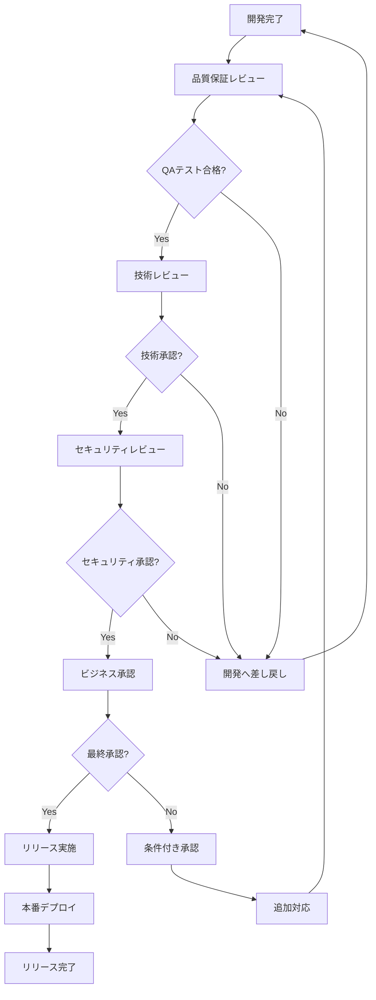
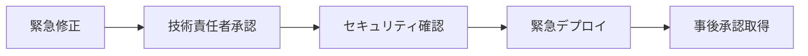

# YouTube Transcriber リリース承認フロー

## 📋 概要

本ドキュメントは、YouTube Transcriberのリリースにおける承認プロセスと責任範囲を定義します。

## 🔄 リリース承認フロー



## 👥 承認者と責任範囲

### 1. 品質保証責任者

**承認基準**:
- テストカバレッジ 60%以上
- 全自動テスト合格
- 重大なバグゼロ
- パフォーマンス基準達成

**確認項目**:
```yaml
quality_criteria:
  test_coverage: ">= 60%"
  test_pass_rate: "100%"
  critical_bugs: 0
  performance_regression: "< 10%"
  documentation_complete: true
```

**承認方法**:
```bash
# QA承認コマンド
youtube-transcriber release approve --role qa --version X.Y.Z
```

### 2. 技術責任者

**承認基準**:
- アーキテクチャ整合性
- コード品質基準達成
- 技術的負債の管理
- スケーラビリティ確保

**確認項目**:
- [ ] コードレビュー完了
- [ ] 設計ドキュメント更新
- [ ] 技術的リスク評価
- [ ] 依存関係の妥当性

**承認方法**:
```bash
# 技術承認コマンド
youtube-transcriber release approve --role tech-lead --version X.Y.Z
```

### 3. セキュリティ責任者

**承認基準**:
- セキュリティスキャンクリア
- 脆弱性ゼロ
- 認証・認可の適切性
- データ保護対策

**確認項目**:
```bash
# セキュリティチェック
pip-audit --strict
bandit -r src/ -ll
safety check
```

**承認方法**:
```bash
# セキュリティ承認
youtube-transcriber release approve --role security --version X.Y.Z
```

### 4. プロダクトオーナー

**承認基準**:
- ビジネス要件充足
- ユーザー価値の提供
- リリースタイミングの妥当性
- ビジネスリスク許容範囲

**確認項目**:
- [ ] 機能要件の実装完了
- [ ] ユーザビリティ確認
- [ ] マーケティング準備
- [ ] サポート体制準備

## 📊 承認ステータス管理

### ステータス定義

| ステータス | 説明 | 次のアクション |
|-----------|------|----------------|
| PENDING | 承認待ち | レビュー実施 |
| IN_REVIEW | レビュー中 | 承認/却下判定 |
| APPROVED | 承認済み | 次の承認者へ |
| REJECTED | 却下 | 開発へ差し戻し |
| CONDITIONAL | 条件付き承認 | 条件クリア確認 |

### 承認記録テンプレート

```yaml
release_approval:
  version: "X.Y.Z"
  approvals:
    - role: "qa"
      approver: "品質保証責任者名"
      status: "APPROVED"
      date: "2024-12-01T10:00:00Z"
      comments: "全テスト合格、カバレッジ61.2%"
      
    - role: "tech-lead"
      approver: "技術責任者名"
      status: "APPROVED"
      date: "2024-12-01T14:00:00Z"
      comments: "アーキテクチャ問題なし"
      
    - role: "security"
      approver: "セキュリティ責任者名"
      status: "APPROVED"
      date: "2024-12-01T16:00:00Z"
      comments: "脆弱性スキャンクリア"
      
    - role: "product-owner"
      approver: "プロダクトオーナー名"
      status: "APPROVED"
      date: "2024-12-02T09:00:00Z"
      comments: "ビジネス要件充足確認"
```

## 🚦 承認プロセスの自動化

### GitHub Actions統合

```yaml
name: Release Approval Workflow

on:
  pull_request:
    branches: [release/*]
    types: [opened, synchronize, review_requested]

jobs:
  approval-check:
    runs-on: ubuntu-latest
    steps:
      - name: Check QA Approval
        uses: ./.github/actions/check-approval
        with:
          role: qa
          required: true
          
      - name: Check Tech Lead Approval
        uses: ./.github/actions/check-approval
        with:
          role: tech-lead
          required: true
          
      - name: Check Security Approval
        uses: ./.github/actions/check-approval
        with:
          role: security
          required: true
          
      - name: Check Product Owner Approval
        uses: ./.github/actions/check-approval
        with:
          role: product-owner
          required: true
          
      - name: Generate Approval Report
        run: |
          python scripts/generate_approval_report.py
```

### Slack通知設定

```python
# scripts/notify_approval_status.py
import requests
from datetime import datetime

def notify_approval_status(version, role, status, approver):
    """承認ステータスをSlackに通知"""
    webhook_url = os.getenv('SLACK_WEBHOOK_URL')
    
    color = {
        'APPROVED': 'good',
        'REJECTED': 'danger',
        'CONDITIONAL': 'warning'
    }.get(status, 'default')
    
    payload = {
        "attachments": [{
            "color": color,
            "title": f"リリース承認ステータス更新 - v{version}",
            "fields": [
                {"title": "承認者", "value": approver, "short": True},
                {"title": "役割", "value": role, "short": True},
                {"title": "ステータス", "value": status, "short": True},
                {"title": "日時", "value": datetime.now().isoformat(), "short": True}
            ]
        }]
    }
    
    requests.post(webhook_url, json=payload)
```

## 📝 承認却下時の対応

### 却下理由カテゴリ

1. **品質問題**
   - テスト失敗
   - バグ発見
   - パフォーマンス劣化

2. **技術問題**
   - アーキテクチャ懸念
   - 技術的負債
   - スケーラビリティ

3. **セキュリティ問題**
   - 脆弱性発見
   - 認証不備
   - データ漏洩リスク

4. **ビジネス問題**
   - 要件不足
   - タイミング不適切
   - リスク過大

### 却下時のアクションテンプレート

```markdown
## リリース却下通知

**バージョン**: X.Y.Z  
**却下者**: [承認者名]  
**役割**: [役割]  
**日時**: [日時]

### 却下理由
[詳細な却下理由]

### 必要なアクション
1. [アクション1]
2. [アクション2]
3. [アクション3]

### 再承認条件
- [条件1]
- [条件2]

### 予想対応時間
[X]時間 / [Y]日

### 担当者
- 開発: [担当者]
- QA: [担当者]
```

## 🔒 緊急リリースプロセス

### 緊急リリース条件

1. **重大なセキュリティ脆弱性**
2. **本番環境の機能停止**
3. **データ損失リスク**
4. **法的コンプライアンス要求**

### 簡略化承認フロー



### 緊急承認プロセス

1. **即時通知**
   ```bash
   youtube-transcriber release emergency --notify-all
   ```

2. **最小承認要件**
   - 技術責任者: 必須
   - セキュリティ: パッチ内容により必須
   - その他: 事後承認可

3. **事後対応**
   - 24時間以内に正式承認取得
   - リリースレポート作成
   - 再発防止策検討

## 📊 承認メトリクス

### KPI定義

| メトリクス | 目標値 | 測定方法 |
|-----------|--------|----------|
| 承認リードタイム | < 24時間 | 申請から最終承認まで |
| 却下率 | < 10% | 却下数/申請数 |
| 再申請成功率 | > 90% | 再承認/却下後申請 |
| 緊急リリース頻度 | < 5% | 緊急/全リリース |

### ダッシュボード表示項目

- 承認待ちリリース
- 承認進捗状況
- 却下理由分析
- 承認者別処理時間

---
最終更新: 2024年12月  
リリース管理チーム