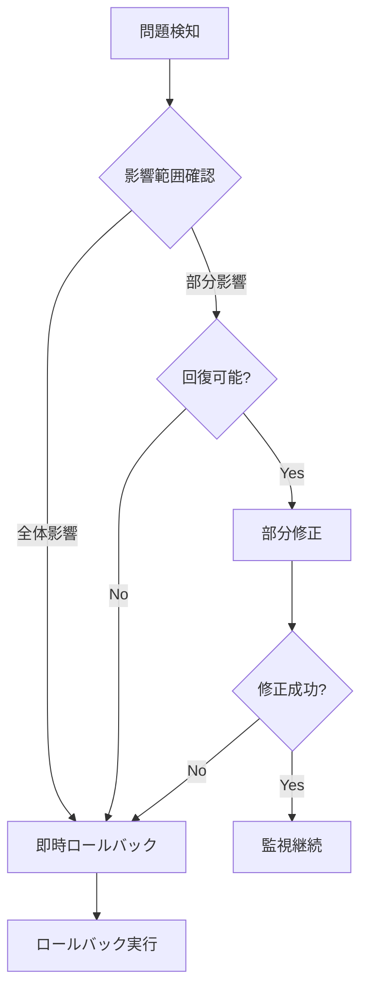
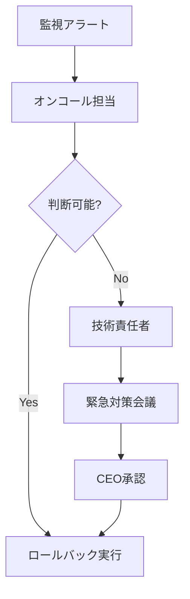

# YouTube Transcriber ロールバック手順書

## 🚨 概要

本ドキュメントは、YouTube Transcriberのリリース後に重大な問題が発生した場合の、迅速かつ安全なロールバック手順を定義します。

## 📊 ロールバック判断基準

### 即時ロールバック条件

以下のいずれかに該当する場合、即座にロールバックを実施：

1. **サービス停止**
   - 全機能の動作停止
   - APIアクセス不可
   - 5分以上の連続エラー

2. **データ破損**
   - 文字起こしデータの破損
   - 設定ファイルの破損
   - ユーザーデータの消失

3. **セキュリティ侵害**
   - 認証バイパス発見
   - データ漏洩の証拠
   - 不正アクセスの形跡

4. **パフォーマンス劣化**
   - 処理速度50%以上低下
   - メモリ使用量2倍以上
   - API応答時間10秒以上

## 🔄 ロールバック手順

### Phase 1: 問題検知と初期対応（5分以内）

```bash
# 1. 現在の状態を保存
youtube-transcriber status --save-state > /tmp/current_state.json

# 2. エラーログ収集
tail -n 1000 logs/app.log > /tmp/error_logs.txt
youtube-transcriber diagnostics --full > /tmp/diagnostics.json

# 3. アラート停止（誤検知防止）
youtube-transcriber monitoring --pause-alerts
```

### Phase 2: ロールバック判断（10分以内）



### Phase 3: ロールバック実施（15分以内）

#### 自動ロールバックスクリプト

```bash
#!/bin/bash
# scripts/rollback.sh

set -e

ROLLBACK_VERSION=$1
BACKUP_DIR="/backup/youtube-transcriber"
LOG_FILE="/var/log/rollback_$(date +%Y%m%d_%H%M%S).log"

echo "=== YouTube Transcriber Rollback Started ===" | tee -a $LOG_FILE
echo "Target Version: $ROLLBACK_VERSION" | tee -a $LOG_FILE
echo "Timestamp: $(date)" | tee -a $LOG_FILE

# 1. 現在のバージョンをバックアップ
echo "Backing up current version..." | tee -a $LOG_FILE
tar -czf $BACKUP_DIR/emergency_backup_$(date +%Y%m%d_%H%M%S).tar.gz \
    /app/youtube-transcriber \
    --exclude='*.log' \
    --exclude='output/*'

# 2. サービス停止
echo "Stopping services..." | tee -a $LOG_FILE
systemctl stop youtube-transcriber
sleep 5

# 3. 前バージョンの復元
echo "Restoring version $ROLLBACK_VERSION..." | tee -a $LOG_FILE
tar -xzf $BACKUP_DIR/release_$ROLLBACK_VERSION.tar.gz -C /

# 4. 設定ファイルの互換性確認
echo "Checking configuration compatibility..." | tee -a $LOG_FILE
youtube-transcriber config --validate

# 5. データベースマイグレーション（必要な場合）
if [ -f "/app/migrations/rollback_$ROLLBACK_VERSION.sql" ]; then
    echo "Running database rollback..." | tee -a $LOG_FILE
    mysql youtube_transcriber < /app/migrations/rollback_$ROLLBACK_VERSION.sql
fi

# 6. サービス再開
echo "Starting services..." | tee -a $LOG_FILE
systemctl start youtube-transcriber

# 7. ヘルスチェック
echo "Running health checks..." | tee -a $LOG_FILE
for i in {1..10}; do
    if youtube-transcriber health --check; then
        echo "Health check passed!" | tee -a $LOG_FILE
        break
    fi
    echo "Health check attempt $i failed, retrying..." | tee -a $LOG_FILE
    sleep 10
done

echo "=== Rollback Completed ===" | tee -a $LOG_FILE
```

### Phase 4: 検証と確認（20分以内）

#### 基本動作確認

```bash
# 1. バージョン確認
youtube-transcriber --version

# 2. 基本機能テスト
youtube-transcriber test --quick

# 3. API応答確認
curl -X GET http://localhost:8080/health

# 4. ログ確認（エラーなし）
tail -f logs/app.log | grep -i error
```

#### 機能別確認項目

| 機能 | 確認コマンド | 期待結果 |
|------|------------|----------|
| 単一動画処理 | `youtube-transcriber <video_url> --dry-run` | 正常完了 |
| チャンネル処理 | `youtube-transcriber @test_channel --limit 1` | 1動画処理成功 |
| API認証 | `youtube-transcriber quota --check` | クォータ表示 |
| 出力生成 | `ls -la output/test/` | ファイル生成確認 |

### Phase 5: 監視再開（25分以内）

```bash
# 1. アラート再開
youtube-transcriber monitoring --resume-alerts

# 2. メトリクス確認
youtube-transcriber metrics --dashboard

# 3. ログ監視開始
tail -f logs/app.log &
```

## 🔧 部分ロールバック手順

### 特定機能のみのロールバック

```python
# scripts/partial_rollback.py
import subprocess
import json
from pathlib import Path

class PartialRollback:
    """特定モジュールのみロールバック"""
    
    def __init__(self, target_module: str, version: str):
        self.target_module = target_module
        self.version = version
        self.backup_path = Path(f"/backup/modules/{version}")
    
    def rollback_module(self):
        """指定モジュールのみ前バージョンに戻す"""
        module_backup = self.backup_path / f"{self.target_module}.tar.gz"
        
        if not module_backup.exists():
            raise FileNotFoundError(f"Backup not found: {module_backup}")
        
        # モジュール停止
        subprocess.run([
            "youtube-transcriber", "module", 
            "--stop", self.target_module
        ])
        
        # バックアップから復元
        subprocess.run([
            "tar", "-xzf", str(module_backup),
            "-C", f"/app/youtube-transcriber/src/{self.target_module}"
        ])
        
        # モジュール再起動
        subprocess.run([
            "youtube-transcriber", "module",
            "--start", self.target_module
        ])
        
        # 動作確認
        result = subprocess.run([
            "youtube-transcriber", "module",
            "--test", self.target_module
        ], capture_output=True)
        
        return result.returncode == 0

# 使用例
if __name__ == "__main__":
    rollback = PartialRollback("services/export_service", "1.0.0")
    if rollback.rollback_module():
        print("✅ Partial rollback successful")
    else:
        print("❌ Partial rollback failed")
```

## 📝 ロールバック後の対応

### 1. インシデントレポート作成

```markdown
## ロールバックインシデントレポート

**インシデント番号**: INC-YYYY-MM-DD-XXX
**発生日時**: 2024-12-01 14:30:00 JST
**ロールバック完了時刻**: 2024-12-01 14:45:00 JST
**影響時間**: 15分

### 問題の概要
[問題の詳細説明]

### 影響範囲
- 影響ユーザー数: XXX
- 処理失敗件数: XXX
- データ損失: なし/あり

### ロールバック理由
[判断基準と根拠]

### 実施内容
1. [実施手順1]
2. [実施手順2]

### 根本原因
[調査結果]

### 再発防止策
1. [対策1]
2. [対策2]

### フォローアップ項目
- [ ] ユーザー通知
- [ ] 影響調査完了
- [ ] 修正版準備
- [ ] 再リリース計画
```

### 2. ユーザー通知

```python
# scripts/notify_rollback.py
def send_rollback_notification():
    """ロールバック通知を送信"""
    notification = {
        "subject": "YouTube Transcriber メンテナンスのお知らせ",
        "body": """
        平素よりYouTube Transcriberをご利用いただき、誠にありがとうございます。
        
        本日14:30頃より発生しておりました不具合により、
        一時的に以前のバージョンに戻させていただきました。
        
        【影響】
        - 14:30-14:45の間、サービスが一時的に利用できない状態
        - 一部の新機能が利用不可
        
        【今後の対応】
        - 問題を修正した新バージョンを準備中
        - 準備が整い次第、再度アップデートを実施
        
        ご迷惑をおかけし、誠に申し訳ございません。
        """
    }
    # 通知送信処理
```

### 3. 事後分析（ポストモーテム）

#### 分析項目

1. **タイムライン作成**
   - 問題発生時刻
   - 検知時刻
   - 対応開始時刻
   - ロールバック完了時刻

2. **根本原因分析（RCA）**
   - なぜ問題が発生したか
   - なぜテストで検出できなかったか
   - なぜ本番で初めて発覚したか

3. **改善アクション**
   - プロセス改善
   - 技術的対策
   - 監視強化

## 🔍 ロールバックテスト

### 定期的なロールバック訓練

```yaml
# .github/workflows/rollback_drill.yml
name: Monthly Rollback Drill

on:
  schedule:
    - cron: '0 0 1 * *'  # 毎月1日

jobs:
  rollback-test:
    runs-on: ubuntu-latest
    steps:
      - name: Deploy Test Version
        run: |
          ./scripts/deploy_test_env.sh v2.0.0
          
      - name: Simulate Failure
        run: |
          ./scripts/inject_failure.sh
          
      - name: Execute Rollback
        run: |
          ./scripts/rollback.sh v1.0.0
          
      - name: Verify Rollback
        run: |
          ./scripts/verify_rollback.sh
          
      - name: Generate Report
        run: |
          ./scripts/generate_drill_report.sh
```

### ロールバック時間目標

| フェーズ | 目標時間 | 実績記録欄 |
|---------|---------|-----------|
| 問題検知 | 2分以内 | _______ |
| 判断決定 | 5分以内 | _______ |
| ロールバック実行 | 10分以内 | _______ |
| 動作確認 | 5分以内 | _______ |
| **合計** | **22分以内** | _______ |

## 📞 緊急連絡体制

### エスカレーションフロー



### 連絡先リスト

| 役割 | 優先度 | 担当者 | 連絡先 | 備考 |
|------|--------|--------|--------|------|
| オンコール | 1 | - | - | 24/7対応 |
| 技術責任者 | 2 | - | - | 技術判断 |
| リリースマネージャー | 3 | - | - | プロセス管理 |
| CEO | 4 | - | - | 最終承認 |

---
最終更新: 2024年12月  
リリース管理チーム