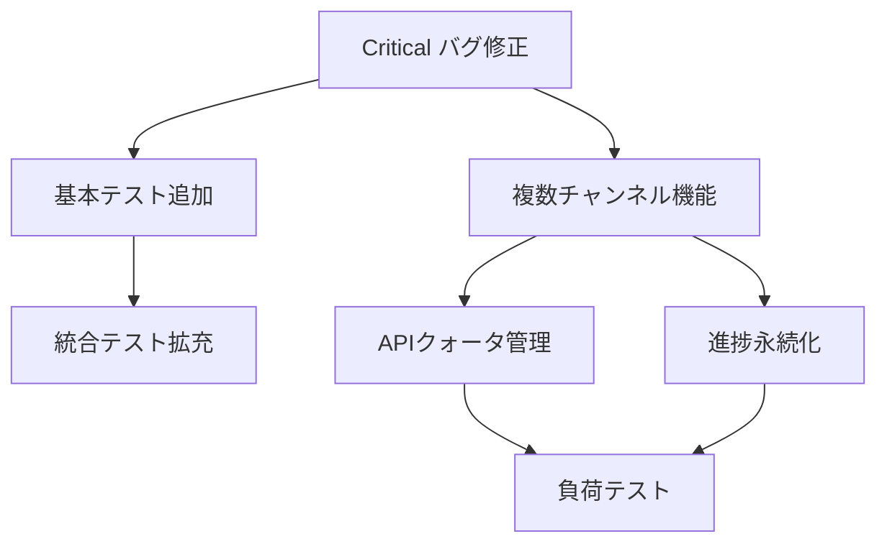

# YouTube Transcriber 統合修正計画書

## エグゼクティブサマリー

3つの調査レポートの分析結果に基づき、YouTube Transcriberの修正実装計画を策定しました。本計画では、緊急度と技術的依存関係を考慮し、4つのフェーズで段階的に実装を進めます。

## 1. 問題の優先順位マトリクス

### 🔴 Critical（即座対応必須）
| 問題 | 影響度 | 修正工数 | 依存関係 |
|------|--------|----------|----------|
| DisplayManager.create_progress()エラー | アプリ停止 | 2h | なし |
| Video.transcript属性エラー | 処理失敗 | 1h | なし |
| NoneType比較エラー | 処理停止 | 1h | なし |
| Live display未開始 | UI表示なし | 2h | なし |

### 🟡 High（早期対応推奨）
| 問題 | 影響度 | 修正工数 | 依存関係 |
|------|--------|----------|----------|
| 複数チャンネル機能欠如 | 利便性低下 | 16h | Critical修正後 |
| エラーハンドリング不足 | 安定性低下 | 8h | なし |
| テストカバレッジ不足 | 品質リスク | 24h | なし |

### 🟢 Medium（計画的対応）
| 問題 | 影響度 | 修正工数 | 依存関係 |
|------|--------|----------|----------|
| APIクォータ追跡なし | 制限リスク | 4h | 複数チャンネル機能 |
| 進捗永続化なし | UX低下 | 6h | 複数チャンネル機能 |
| 統計更新頻度 | UX低下 | 2h | なし |

## 2. 技術的依存関係



## 3. 段階的実装計画

### Phase 1: 緊急バグ修正（1-2日）

#### 1.1 DisplayManager修正
```python
# src/cli/display.py
def create_progress(self):
    """Progress context manager実装"""
    from contextlib import contextmanager
    
    @contextmanager
    def progress_context():
        progress = Progress(...)
        task_id = progress.add_task(...)
        try:
            yield progress, task_id
        finally:
            progress.stop()
    return progress_context()
```

#### 1.2 Video属性修正
```python
# src/models/video.py
@property
def transcript_data(self):
    return self._transcript_data

# 使用箇所の修正
# video.transcript → video.transcript_data
```

#### 1.3 型安全性向上
```python
# 全般的な修正パターン
if value is not None and value < threshold:
    # 処理
```

#### 1.4 Live display統合
```python
# src/application/orchestrator.py
async def process_channel(self, ...):
    self.display.start()  # 追加
    try:
        # 既存処理
    finally:
        self.display.stop()  # 追加
```

### Phase 2: 基本品質向上（3-4日）

#### 2.1 単体テスト追加
- CLI引数パーステスト
- 各サービスクラステスト
- モデルバリデーションテスト
- エラーハンドリングテスト

#### 2.2 エラーハンドリング強化
```python
# グローバルエラーハンドラー
class ErrorHandler:
    @staticmethod
    def wrap_with_fallback(func):
        async def wrapper(*args, **kwargs):
            try:
                return await func(*args, **kwargs)
            except RichError:
                # フォールバック表示
            except Exception as e:
                # ユーザーフレンドリーメッセージ
        return wrapper
```

### Phase 3: 複数チャンネル機能実装（5-7日）

#### 3.1 アーキテクチャ拡張
- BatchChannelOrchestrator実装
- CLI引数拡張
- 設定モデル追加

#### 3.2 並列処理実装
- チャンネルレベル並列制御
- グローバルレート制限
- エラー分離

#### 3.3 UI/UX改善
- バッチ進捗表示
- 統合レポート生成

### Phase 4: 品質保証・最適化（3-4日）

#### 4.1 包括的テスト
- 統合テスト実施
- 負荷テスト
- エッジケーステスト

#### 4.2 パフォーマンス最適化
- メモリ使用量最適化
- API呼び出し効率化

#### 4.3 ドキュメント整備
- ユーザーガイド更新
- API仕様書作成
- 運用マニュアル

## 4. リスク分析と軽減策

### リスク1: 既存機能への影響
**軽減策**: 
- 機能フラグによる段階的有効化
- 既存テストの継続的実行
- ロールバック計画

### リスク2: API制限違反
**軽減策**:
- 保守的なレート設定（50req/min）
- バックオフ戦略実装
- 事前警告機能

### リスク3: メモリ不足
**軽減策**:
- ストリーミング処理
- チャンネル数制限（デフォルト3）
- メモリ監視機能

## 5. 成功指標

### 技術的指標
- テストカバレッジ: 80%以上
- エラー率: 1%以下
- 平均処理時間: 既存比±10%以内

### ビジネス指標
- 複数チャンネル同時処理: 最大10チャンネル
- 処理中断からの回復: 100%
- ユーザー満足度: 向上

## 6. 実装チーム編成案

### Phase 1-2: バグ修正・基礎品質
- **Dev1**: UI/Display修正担当
- **Dev2**: モデル/サービス修正担当
- **Dev3**: テスト実装担当

### Phase 3-4: 機能拡張・最適化
- **Dev1**: UI/UX実装
- **Dev2**: バックエンド/並列処理
- **Dev3**: テスト/品質保証

## 7. タイムライン

```
Week 1: Phase 1 (Critical修正) + Phase 2開始
Week 2: Phase 2完了 + Phase 3開始
Week 3: Phase 3実装
Week 4: Phase 4 (テスト・最適化)
```

## 8. 次のアクション

1. **即座**: Critical バグ4件の修正開始
2. **1日以内**: テスト環境セットアップ
3. **2日以内**: 複数チャンネル機能の詳細設計レビュー
4. **1週間以内**: Phase 1-2完了、Phase 3開始

## 結論

本計画に従って実装を進めることで、YouTube Transcriberの安定性向上と機能拡張を効率的に実現できます。特に、緊急バグ修正を最優先で対応することで、ユーザー体験を早期に改善し、その後の機能拡張の基盤を整えます。

---
作成日: 2025-06-22
作成者: 技術リード・アーキテクト (dev2)